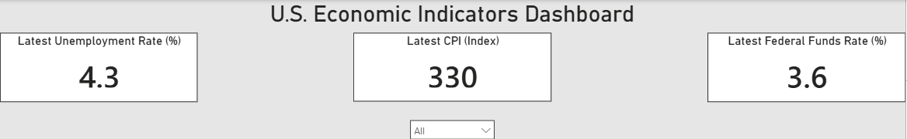
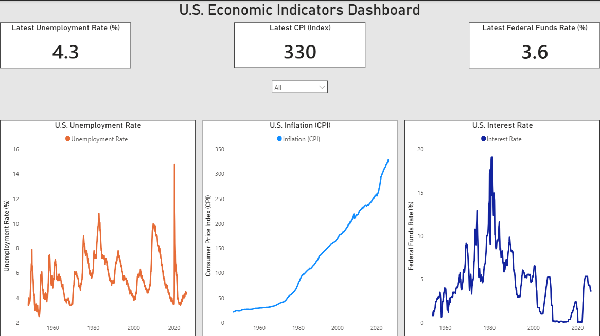

# U.S. Economic Indicators Dashboard
## Overview
This project builds a dynamic economic dashboard using real-world data from the Federal Reserve Economic Data (FRED) API. 

It tracks key U.S. economic indicators including:
- Unemployment Rate
- Inflation (CPI)
- Federal Funds Interest Rate

The project demonstrates an end-to-end data workflow:
Python → SQL → Power BI
## Tools Used
- Python (data extraction and processing)
- SQL (data storage and querying)
- Power BI (data visualization and dashboarding)
- FRED API (economic data source)
## Key Features
- Automated data extraction from FRED API
- Multi-indicator dataset (unemployment, inflation, interest rates)
- SQL-based data storage and structured querying
- Interactive Power BI dashboard with KPI tracking
- Time-series analysis across decades of economic data
## Dashboard Preview

### KPI Snapshot

### Full Dashboard

## How It Works
1. Python script pulls economic data from the FRED API
2. Data is cleaned and standardized
3. Data is stored in a SQLite database
4. Data is exported to CSV for visualization
5. Power BI dashboard displays KPIs and trends
## Project Structure
Economic_Job_Market_Dashboard/
├── assets/
│ ├── dashboard_kpi.png
│ └── dashboard_full.png
├── data/
│ └── economic_data.csv
├── scripts/
│ └── fred_data_pull.py
├── sql/
│ ├── 01_preview_indicators.sql
│ └── 02_powerbi_view.sql
├── powerbi/
│ └── us-economic-indicators-dashboard.pbix
├── README.md
└── requirements.txt
## Why This Project Matters
This project demonstrates the ability to:
- Work with real-world API data
- Design and manage a structured data pipeline
- Use SQL for data validation and transformation
- Build clear, business-focused dashboards
